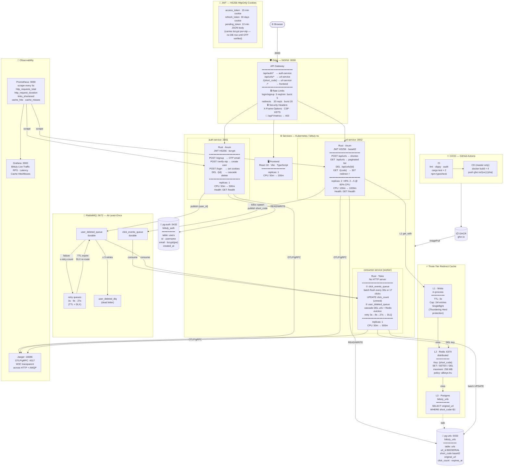
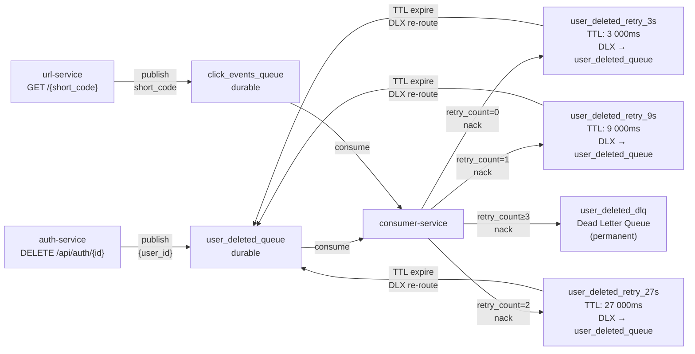
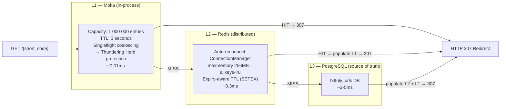
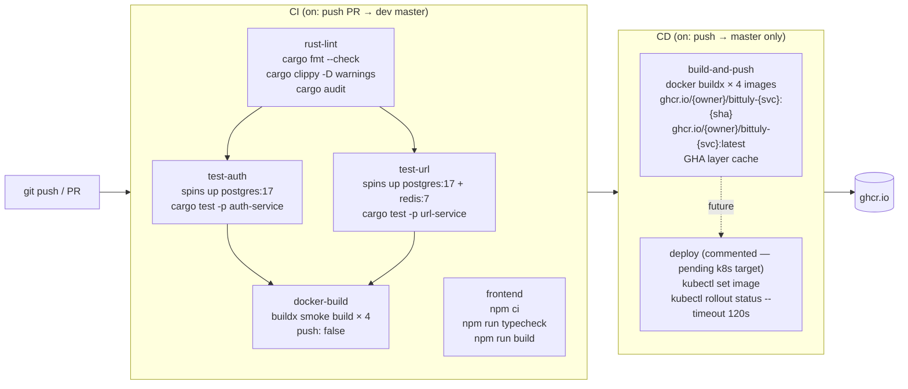

# Bittuly — Distributed URL Shortener

Bittuly is a production-grade, distributed URL shortener built with **Rust (Axum)** and **React (Vite)**. It uses a microservices architecture with isolated databases per service, a two-tier caching system, asynchronous event-driven analytics, and full observability via OpenTelemetry, Prometheus, and Grafana.

## K8S Topology


---

## 🏗️ Architecture Design

```mermaid
graph TB
    %% ─── External Clients ───────────────────────────────────────────────────
    Client(["👤 Client\n(Browser / API)"])

    %% ─── CI/CD Pipeline ─────────────────────────────────────────────────────
    subgraph CICD ["☁️ CI/CD  —  GitHub Actions"]
        direction LR
        CI["🔎 CI Pipeline\ncargo fmt · clippy · cargo audit\ncargo test -p auth-service\ncargo test -p url-service\nnpm typecheck + build"]
        CD["📦 CD Pipeline\ndocker build × 4 images\npush ghcr.io/{owner}/bittuly-{svc}:{sha}\n+ :latest tag"]
        CI --> CD
    end
    GHCR[("📦 GHCR\nghcr.io\nauth-service:{sha}\nurl-service:{sha}\nconsumer-service:{sha}\nfrontend-service:{sha}")]
    CD --> GHCR

    %% ─── Kubernetes Cluster ──────────────────────────────────────────────────
    subgraph K8S ["⚓ Kubernetes Cluster  —  Namespace: bittuly"]
        direction TB

        subgraph Ingress ["🔀 NGINX Ingress Controller"]
            IG["nginx-ingress\nlimit-rps: 2000\n/api/auth → auth-service:3001\n/api/urls → url-service:3002\n/ → frontend-service:80"]
        end

        subgraph Gateway ["🛡️ NGINX API Gateway  (port 8000)"]
            direction TB
            GW["nginx:1.31.1-alpine\nworker_processes: auto\nworker_connections: 50 000\nmax FD: 200 000\n\n─── Rate Limiting ───\nredirect_limit  20 req/s  burst 20  200 MB zone\nauth_limit      5 req/min burst 5   50 MB zone\n\n─── Security Headers ───\nX-Frame-Options: DENY\nX-Content-Type-Options: nosniff\nX-XSS-Protection: 1; mode=block\nReferrer-Policy: strict-origin-when-cross-origin\nPermissions-Policy: camera=() microphone=() geolocation=()\nContent-Security-Policy: default-src 'self'\n\n─── Routing ───\nGET /api/*/metrics          → 403 Forbidden\nPOST /api/auth/login|signup → auth :3001 + auth_limit\n/api/auth/*                 → auth :3001\n/api/urls/*                 → url :3002\n/{short_code}               → url :3002 + redirect_limit\n/  dashboard  login  signup → frontend :5173"]
        end

        subgraph Services ["⚙️ Microservices"]
            direction LR

            subgraph AuthSvc ["auth-service  (port 3001)"]
                direction TB
                AS["Rust · Axum · HS256 JWT\n─── HTTP Routes ───\nPOST /api/auth/signup        → OTP email, returns pending_token JWT\nPOST /api/auth/verify-otp    → verify OTP, create user, set cookies\nPOST /api/auth/login         → bcrypt verify, set cookies\nPOST /api/auth/logout        → clear cookies\nGET  /api/auth/{user_id}     → get user (owner only)\nPUT  /api/auth/{user_id}     → update user, re-issue JWTs\nDEL  /api/auth/{user_id}     → delete user, publish to RabbitMQ\nGET  /api/auth/health        → health check\nGET  /api/auth/metrics       → Prometheus (blocked by GW)\n\n─── K8s Resources ───\nreplicas: 1  CPU: 50m→500m  Mem: 64Mi→256Mi\nliveness:  GET /api/auth/health (delay 10s period 15s)\nreadiness: GET /api/auth/health (delay  5s period  5s)"]
                ASRB["📤 Publishes\nuser_deleted_queue\npayload: { user_id: UUID }\nW3C traceparent in AMQP headers"]
            end

            subgraph UrlSvc ["url-service  (port 3002)"]
                direction TB
                US["Rust · Axum · HS256 JWT\n─── HTTP Routes ───\nPOST /api/urls               → shorten URL, incr links_shortened metric\nGET  /api/urls               → cursor-paginated list (default 20 max 100)\nDEL  /api/urls/{id}          → delete URL, evict Redis + Moka cache\nGET  /{short_code}           → HTTP 307 redirect (hot path)\nGET  /api/urls/health        → health check\nGET  /api/urls/metrics       → Prometheus (blocked by GW)\n\n─── K8s Resources ───\nreplicas: 2  CPU: 100m→1000m  Mem: 128Mi→512Mi\nHPA: min=2 max=5 CPU target=60%\nliveness:  GET /api/urls/health (delay 10s period 15s)\nreadiness: GET /api/urls/health (delay  5s period  5s)\n\n─── Short Code Generation ───\nbase62( url_id: BIGSERIAL )\nINSERT urls → get url_id → UPDATE short_code (in transaction)"]
                USRB["📤 Publishes\nclick_events_queue\npayload: raw UTF-8 short_code bytes\nfire-and-forget via tokio::spawn\nW3C traceparent in AMQP headers"]
            end

            subgraph ConsSvc ["consumer-service  (no HTTP server)"]
                direction TB
                CS["Rust · Tokio worker\n─── Consumers ───\n\n① click_events_queue  (tag: consumer_service_clicks)\n  in-memory HashMap short_code→count\n  Flush on: size ≥ 17 clicks  OR  timer every 30s\n  SQL: UPDATE urls SET click_count = click_count + delta\n       FROM unnest arrays  (single batch statement)\n  ACK: basic_ack(multiple=true) on success\n  NACK: basic_nack(multiple=true, requeue=true) on DB failure\n  Retry: exponential backoff 3^n seconds\n\n② user_deleted_queue  (tag: consumer_service_users)\n  Extract W3C traceparent from AMQP headers\n  DELETE FROM urls WHERE user_id = $1 RETURNING short_code\n  DEL {short_code} from Redis  (per returned code)\n  ACK on success\n  Retry: x-retry-count header\n    count 0-2 → user_deleted_retry_{3|9|27}s queue (TTL+DLX)\n    count ≥ 3 → user_deleted_dlq (Dead Letter Queue)\n  Invalid JSON → silent ack-discard\n\n─── K8s Resources ───\nreplicas: 1  CPU: 50m→500m  Mem: 64Mi→256Mi"]
            end

            subgraph FeSvc ["frontend-service  (port 80 / dev :5173)"]
                FE["React 18 · TypeScript · Vite · React Router v6\n─── Pages ───\n/signup       Signup (OTP step 1)\n/verify-otp   VerifyOtp (OTP step 2)\n/login        Login\n/dashboard    Dashboard (ProtectedRoute)\n/insights     Insights (ProtectedRoute)\n/profile      Profile (ProtectedRoute)\n/settings     Settings (ProtectedRoute)\n/health       ServiceHealth (ProtectedRoute)\n/unavailable  Unavailable (fallback)\n\n─── Auth ───\nAuthContext + ProtectedRoute\nJWT via HttpOnly cookies (no JS access)\n\n─── K8s Resources ───\nreplicas: 1  CPU: 50m→200m  Mem: 64Mi→128Mi"]
            end
        end

        subgraph DataLayer ["🗄️ Data Layer"]
            direction LR

            subgraph Caching ["⚡ Three-Tier Redirect Cache"]
                direction TB
                L1["L1 — Moka (in-process)\nType: future::Cache\nCapacity: 1 000 000 entries\nTTL: 3 seconds\nStrategy: Singleflight coalescing\n(Thundering Herd protection)\nKey: short_code → Option(original_url, expires_at)"]
                L2["L2 — Redis 8 (distributed)\nConnectionManager (auto-reconnect)\nmaxmemory: 256 MB  policy: allkeys-lru\nKey pattern: {short_code}\nSET {code} {url}          (permanent)\nSETEX {code} {url} {ttl}  (expiring)\nDEL {code}                (on delete)"]
                L3["L3 — PostgreSQL (source of truth)\nQuery: SELECT original_url, expires_at\nFROM urls WHERE short_code = $1"]
                L1 --> L2
                L2 --> L3
            end

            PGA[("🐘 pg-auth\nPostgres 17\nport 5432\nDB: bittuly_auth\n\ntable: users\n  id UUID PK\n  username TEXT\n  email TEXT UNIQUE\n  password TEXT (bcrypt)\n  created_at TIMESTAMPTZ\n  updated_at TIMESTAMPTZ")]

            PGU[("🐘 pg-urls\nPostgres 17\nport 5433\nDB: bittuly_urls\n\ntable: urls\n  url_id BIGSERIAL PK\n  short_code TEXT UNIQUE (base62)\n  original_url TEXT\n  user_id UUID FK\n  click_count BIGINT\n  expires_at TIMESTAMPTZ nullable\n  created_at TIMESTAMPTZ\n  updated_at TIMESTAMPTZ")]

            RD[("🔴 Redis 8\nport 6379\nL2 redirect cache\nURL expiry-aware TTL")]
        end

        subgraph Messaging ["📨 RabbitMQ 4 — Event Bus (At-Least-Once)"]
            direction TB
            RMQ["RabbitMQ 4.3.1-management\nport 5672  management: 15672\nAll queues: durable\n\n─── Queue Topology ───\nclick_events_queue\n  │  payload: raw short_code bytes\n  └→ consumer-service (batch flush to pg-urls)\n\nuser_deleted_queue  ◄──────────────────────────────┐\n  │  payload: { user_id: UUID }                      │ DLX re-route\n  │  AMQP headers: W3C traceparent                   │ (on TTL expire)\n  └→ consumer-service                                │\n       ├─ success  → basic_ack                       │\n       ├─ retry 1  → user_deleted_retry_3s  (TTL 3s) ┤\n       ├─ retry 2  → user_deleted_retry_9s  (TTL 9s) ┤\n       ├─ retry 3  → user_deleted_retry_27s (TTL 27s)┤\n       └─ retry ≥3 → user_deleted_dlq (permanent DLQ)"]
        end

        subgraph Observability ["🔭 Observability Stack"]
            direction LR
            JAE["Jaeger 2.18.0\nOTLP/gRPC :4317\nUI: :16686\n\nTraced services:\n  auth-service\n  url-service\n  consumer-service\n\nSpans:\n  All HTTP routes (OtelAxumLayer)\n  delete_user AMQP publish\n  get_original_url AMQP publish\n  process_click_batch\n    attrs: batch_size, unique_urls\n  process_user_deleted_event\n    attrs: user_id\n  W3C traceparent propagated\n  across HTTP + AMQP boundaries"]

            PROM["Prometheus v3\nUI: :9090\nScrape interval: 5s\n\nMetrics:\n  http_requests_total\n    {method, path, status}\n  http_request_duration_seconds\n    {method, path, status}\n  links_shortened (counter)\n  cache_hits   (counter)\n  cache_misses (counter)\n  rabbit_mq_events_published\n    {queue=click_events_queue}"]

            GF["Grafana 11.6\nUI: :3000  (admin/admin)\nDashboard:\n  Bittuly Live Traffic\n  RPS · Latency\n  Cache Hits / Misses\n  Business Metrics"]

            PROM --> GF
        end

        subgraph JWT ["🔐 JWT Token System (HS256 / HttpOnly Cookies)"]
            direction TB
            JWTD["access_token   cookie  TTL 15 min\n  { sub: UUID, exp, token_type: access }\n  HttpOnly · SameSite=Strict · Secure (prod)\n\nrefresh_token  cookie  TTL 30 days\n  { sub: UUID, exp, token_type: refresh }\n  Silent auto-rotation on expiry\n\npending_token  JSON body  TTL 10 min\n  { email, username, bcrypt(password),\n    bcrypt(otp), token_type: pending }\n  Never stored in DB until OTP verified\n  Two-phase OTP: no user row until verified"]
        end
    end

    %% ─── Connections ─────────────────────────────────────────────────────────
    Client -->|"HTTPS / HTTP"| CICD
    Client -->|"HTTP :8000"| GW
    GW --> IG
    IG --> AS
    IG --> US
    IG --> FE
    AS -->|"bcrypt + sqlx"| PGA
    AS --> ASRB
    ASRB -->|"AMQP publish"| RMQ
    US -->|"sqlx"| PGU
    US -->|"Moka L1\nget_with singleflight"| L1
    L1 -->|"cache miss"| L2
    L2 -->|"Redis miss"| L3
    L3 -->|"sqlx"| PGU
    US --> USRB
    USRB -->|"tokio::spawn\nAMQP publish"| RMQ
    RMQ -->|"consume click_events_queue"| CS
    RMQ -->|"consume user_deleted_queue"| CS
    CS -->|"batch UPDATE click_count"| PGU
    CS -->|"DEL {short_code}"| RD
    L2 -.->|"backed by"| RD
    AS -->|"OTLP/gRPC"| JAE
    US -->|"OTLP/gRPC"| JAE
    CS -->|"OTLP/gRPC"| JAE
    PROM -->|"scrape :3001/metrics"| AS
    PROM -->|"scrape :3002/metrics"| US
    GHCR -->|"imagePullSecret"| K8S
```





---

## 🔁 Key Request Flows

### Flow 1 — URL Redirect (Hot Path, p99 < 4ms)

```
Client ──► NGINX (redirect_limit 20rps)
         ──► url-service GET /{short_code}
               ├─ L1 HIT  → Moka cache (singleflight, ~0.01ms) → HTTP 307
               ├─ L2 HIT  → Redis GET {code} (~0.3ms) → HTTP 307
               └─ L3 MISS → PostgreSQL SELECT → populate Redis + Moka → HTTP 307
                                ↓ (fire-and-forget, non-blocking)
                           tokio::spawn → publish short_code to click_events_queue
```

### Flow 2 — User Signup (Two-Phase OTP)

```
Client ──► POST /api/auth/signup
           │  validate payload (validator crate)
           │  generate 6-digit OTP
           │  bcrypt(otp) + bcrypt(password)
           │  create pending_token JWT (10 min TTL) carrying { email, username, bcrypt(pw), bcrypt(otp) }
           │  send OTP email via SMTP (lettre) [dev: print to console]
           └─ return { pending_token }  [no DB write yet]

Client ──► POST /api/auth/verify-otp  { pending_token, otp }
           │  decode pending_token JWT
           │  bcrypt verify otp
           │  INSERT INTO users (...)  [first DB write]
           │  generate access_token (15m) + refresh_token (30d)
           └─ set HttpOnly cookies + return user
```

### Flow 3 — User Deletion Cascade

```
Client ──► DELETE /api/auth/{user_id}
           │  DELETE FROM users WHERE id = $1
           │  publish { user_id } to user_deleted_queue (AMQP, W3C traceparent injected)
           └─ HTTP 204 immediately returned

[async] consumer-service ◄── user_deleted_queue
           │  DELETE FROM urls WHERE user_id = $1 RETURNING short_code
           │  for each short_code: DEL url:{short_code} from Redis
           └─ basic_ack
                ↓ on failure (DB down)
           retry_count 0 → user_deleted_retry_3s  (TTL 3s → DLX back to queue)
           retry_count 1 → user_deleted_retry_9s  (TTL 9s → DLX back to queue)
           retry_count 2 → user_deleted_retry_27s (TTL 27s → DLX back to queue)
           retry_count ≥ 3 → user_deleted_dlq (permanent dead letter)
```

### Flow 4 — Click Analytics (Eventually Consistent, Batched)

```
[background] consumer-service ◄── click_events_queue (continuous stream)
           │  accumulate in HashMap<short_code, delta_count>
           │
           ├─ trigger: total_clicks ≥ 17
           └─ trigger: tokio::interval every 30s
                ↓
           UPDATE urls SET click_count = click_count + delta
           FROM (SELECT unnest($1::text[]) AS code, unnest($2::bigint[]) AS delta) d
           WHERE urls.short_code = d.code
                ↓ success               ↓ failure
           basic_ack(multiple=true)  basic_nack(requeue=true)
           clear HashMap             exponential backoff (3^n seconds)
```

---

## 📨 RabbitMQ Queue Topology



---

## ⚡ Three-Tier Caching Strategy (Redirect Hot Path)



---

## 🚀 Getting Started

### 1. Start Infrastructure

```bash
docker compose up -d
```

Starts: `postgres-auth` (5432) · `postgres-urls` (5433) · `redis` (6379) · `rabbitmq` (5672/15672) · `jaeger` (16686) · `prometheus` (9090) · `grafana` (3000) · `nginx` (8000)

### 2. Configure Environment

Copy `.env.example` to `.env`. Set `MODE=development` to print OTPs to console instead of sending emails.

```bash
cp .env.example .env
```

### 3. Run Services

```bash
cargo dev-auth      # Terminal 1 — auth-service :3001
cargo dev-urls      # Terminal 2 — url-service  :3002
cargo dev-consumer  # Terminal 3 — consumer-service
cd web && npm run dev   # Terminal 4 — frontend :5173
```

Access via NGINX gateway: `http://localhost:8000`

### 4. Run Tests

```bash
./scripts/test.sh           # all services
./scripts/test.sh auth      # auth-service only
./scripts/test.sh url       # url-service only
```

---

## ⚓ Kubernetes Local Deployment

### Deploy

```bash
./scripts/k8s.sh up     # create kind cluster + load images + apply manifests
./scripts/k8s.sh down   # destroy cluster
```

### Access

| Service | URL |
|---|---|
| App + API Gateway | `http://localhost:8000` |
| RabbitMQ UI | `kubectl port-forward -n bittuly svc/rabbitmq 15672:15672` |
| Jaeger UI | `kubectl port-forward -n bittuly svc/jaeger 16686:16686` |

### K8s Resource Summary

| Workload | Replicas | CPU | Memory | HPA |
|---|---|---|---|---|
| auth-service | 1 | 50m → 500m | 64Mi → 256Mi | — |
| url-service | 2 | 100m → 1000m | 128Mi → 512Mi | min 2, max 5, CPU 60% |
| consumer-service | 1 | 50m → 500m | 64Mi → 256Mi | — |
| frontend-service | 1 | 50m → 200m | 64Mi → 128Mi | — |

---

## 🛡️ CI/CD Pipeline



---

## 📊 Observability Endpoints

| Tool | URL | Purpose |
|---|---|---|
| NGINX Gateway | `http://localhost:8000` | Main entry point |
| Grafana | `http://localhost:3000` (admin/admin) | Live traffic dashboards |
| Prometheus | `http://localhost:9090` | Raw metrics + query |
| Jaeger | `http://localhost:16686` | Distributed traces |
| RabbitMQ UI | `http://localhost:15672` (bittu/bittu) | Queue management |

> **Note**: `/api/*/metrics` endpoints are blocked with `403` at the NGINX gateway level. Prometheus scrapes services directly on their internal ports.

---

## 🛠️ Useful Commands

### Local Development

```bash
# Run a service with hot-reload (cargo-watch required)
cargo dev-auth        # auth-service   :3001
cargo dev-urls        # url-service    :3002
cargo dev-consumer    # consumer-service

# Run tests per service
cargo test-auth       # auth-service tests (uses localhost:5432)
cargo test-urls       # url-service tests  (uses localhost:5433)

# Or use the convenience script (handles DATABASE_URL switching)
./scripts/test.sh           # all services
./scripts/test.sh auth      # auth-service only
./scripts/test.sh url       # url-service only

# Wipe databases and restart fresh
docker compose down -v && docker compose up -d

# Production build
cargo build --release
```

### Kubernetes

```bash
# Full cluster lifecycle
./scripts/k8s.sh up       # create kind cluster, install CNPG operator, load images, apply manifests
./scripts/k8s.sh deploy   # rebuild images + re-apply manifests on an existing cluster
./scripts/k8s.sh status   # show nodes, pods, and services
./scripts/k8s.sh down     # tear down the kind cluster

# Load test (k6 — runs inside the cluster via kubectl)
./scripts/load-test.sh

# Port-forward internal services for local inspection
kubectl port-forward -n bittuly svc/rabbitmq 15672:15672   # RabbitMQ management UI
kubectl port-forward -n bittuly svc/jaeger   16686:16686   # Jaeger trace UI

# Delete the legacy standalone Postgres pods (superseded by CloudNativePG)
kubectl delete deployment postgres-auth postgres-urls -n bittuly
```

### Database (CloudNativePG)

```bash
# Connect to auth primary
kubectl exec -it postgres-auth-1 -n bittuly -- psql -U postgres -d bittuly_auth

# Connect to urls primary
kubectl exec -it postgres-urls-1 -n bittuly -- psql -U postgres -d bittuly_urls

# Check cluster health
kubectl get clusters -n bittuly
```

---

## 🪝 Git Hooks

Two local git hooks are provided in `scripts/` and must be installed manually once:

```bash
# Install hooks
cp scripts/pre-commit.sh .git/hooks/pre-commit && chmod +x .git/hooks/pre-commit
cp scripts/pre-push.sh   .git/hooks/pre-push   && chmod +x .git/hooks/pre-push
```

| Hook | Trigger | What it does |
|---|---|---|
| `pre-commit` | Every `git commit` | Runs `cargo fmt --all` and re-stages any formatted files automatically |
| `pre-push` | Every `git push` | Runs the full local CI suite: `cargo fmt`, `cargo clippy`, `cargo test`, `npm typecheck`, `npm build` |

> **Tip:** The pre-push hook runs the same checks as the GitHub Actions CI pipeline, so you catch failures locally before they hit the remote.
